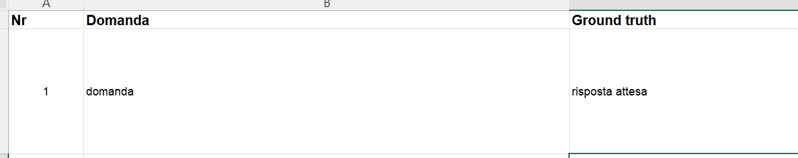
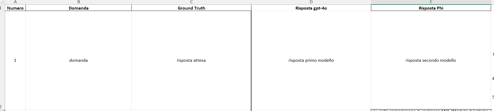
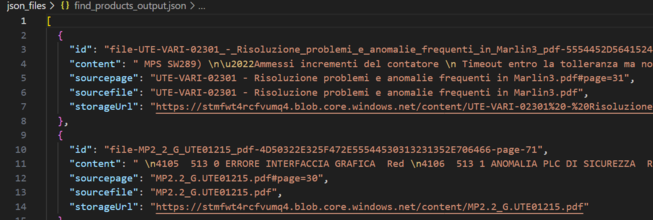

# Calcolo metriche di valutazione su risposte dei modelli gpt-4o e Phi-3-small-128k

## Table of Contents
- [Features](#features)
- [Setup](#setup)
- [Input](#input)
    - [Input singola domanda](#input-singola-domanda)
    - [Input serie di domande](#input-serie-di-domande)
- [Output](#output)
    - [Output singola domanda](#output-singola-domanda)
    - [Output serie di domande](#output-serie-di-domande)
- [Aggiungere un modello](#aggiungere-un-modello)
- [Indice](#indice)
- [Variabili di ambiente](#variabili-di-ambiente)


Questo programma crea un epserienza simile a ChatGPT sui tuoi dati, usando la RAG (Retrieval Augmented Generation).
Si utilizza Azure OpenaAI Service per accedere ai modelli e Azure AI Search per l'indicizzazione e il recupero dei file.

La repository include dei dati di esempio in modo che sia possibile provarla end to end. E' possibile chiedere al chatbot quesiti tecnici o generali, riguardanti l'azienda.

Lo scopo principale è quello di testare una serie di domande su più modelli in modo da valutarne la bontà della risposta.

## Features
* Effettuare domande al chatbot sfruttando il sistema RAG
* Utilizzo di più modelli (gpt-4o e Phi-3-small-128k)
* Possibilità di ricerca più specifica generando 5 query significative per la domanda
* Calcolo delle metriche di qualità della risposta
* Valutazione di una serie di domande scritte in un file excel
* Output facilmente leggibile in formato .xlsx

## Setup
Per poter eseguire correttamente il programma occorre:
* Python 3.11.9 (versione su cui è stato testato, potrebbe funzionare con altre versioni).
* Creare un virtual environment `.venv` con i requisiti che si trovano nel file `requirements.txt`
* Creare un file `.env` dove porre i dati di accesso al proprio account Azure e ai vari deployment
* Fornire un file formato `.xlsx` contenente una serie di domande da testare. Il formato della domanda è il seguente:
    * Numero della domanda
    * Domanda
    * Ground truth (risposta attesa)

## Input
E' possibile testare il programma in più modi, su una singola domanda o su una serie di domande.

### Input singola domanda
Procedere inserendo domanda e ground truth nel relativo file di test all'interno della cartella `test` e runnando il codice python
``` shell
# Definizione della domanda e della risposta attesa
question="tua domanda"
ground_truth="risposta attesa"
```
### Input serie di domande
Procedere seguendo i seguenti passaggi:
* Creare un file excel contenente le seguenti informazioni:
    * Numero della domanda (Nome colonna: Nr)
    * Domanda
    * Ground truth (risposta attesa)


* Inserire il file all'interno della cartella `xlsx`
* Inserire il nome del file su `run.py`:
``` shell
excel_file="nomeFile.xlsx" # Nome del file excel di input da cui prende domanda e ground truth
```
* Runnare il file `run.py`

## Output

### Output singola domanda
L'output per la singola domanda (eseguendo dal file di test), viene mostrato direttamente su console.
Esempio:
``` shell
Risposta: risposta.
Sources: ['file.pdf#page=16', 'file.pdf#page=8']
Similarity: 3
Groundedness: 5
Coherence: 1
Fluency: 1
Relevance: 4
```
Viene stampata la risposta e i valori delle metriche. Il formato dell'output può variare a seconda del modello (es: gpt-4o restituisce un JSON con risposta e sources, Phi-3-small-128k invece restituisce solo la risposta).

### Output serie di domande
L'output restituito dalla valutazione di una serie di domande (runnando `run.py`) è un file excel chiamato `output.xlsx`, reperibile nella cartella `xlsx`.
E' possibile cambiare il nome del file di output sostituendo con il nome desiderato del file quello di default all'interno del file `run.py`.
``` shell
...
# Scrittura dei risultati finali su un file Excel
with pd.ExcelWriter(base/"xlsx/output.xlsx", engine="xlsxwriter") as writer:
...
```
Il formato dell'output è il seguente:
| Numero | Domanda | Risposta modelli | Metriche |

Viene stampata anche la media che il modello ha ottenuto su quella determinata metrica.

## Aggiungere un modello

### Creare i writers
Per aggiungere un modello bisogna creare i writers per il modello, si tratta di due file per ogni modello, un `.prompty` e un `.py`.
#### Modelli azure_openai
Per i modelli `azure_openai` si possono copiare i writer di GPT e cambiare le seguenti informazioni.
Nel file `.prompty`, se il modello si trova all'interno dello stesso endpoint, bisogna cambiare solo il nome del deployment:
``` shell
configuration:
    type: azure_openai
    azure_deployment: "nomeTuoDeployment"
```
> [!IMPORTANTE]
> Tutti i modelli di tipo `azure_openai` devono essere deployati all'interno dello stesso endpoint, questo perchè lo schema dei file `.prompty` non prevede un `azure_api_key` o simile, quindi preleva l'informazione direttamente dal `.env`.

Bisogna inoltre modificare il richiamo al prompty nel `writer.py`:
``` shell
# Caricamento del flusso PromptFlow specifico
    flow = Flow.load(
        base / "tuoWriter.prompty",
    )
```

> Assicurati che il modello da te selezionato sia compatibile con il formato di output presente (ad esempio non tutti i modelli supportano un output di tipo JSON), in caso contrario è necessario apportare delle modifiche.

#### Modelli serverless
Per i modelli `serverless` si possono copiare i writer di Phi e cambiare le seguenti informazioni.
``` shell
configuration:
    type: serverless
    endpoint: ${env:AZURE_INFERENCE_ENDPOINT2}
    model: nomeModello
    key: ${env:AZURE_INFERENCE_CREDENTIAL2}
```
> Assicurati di aggiungere i riferimenti nel tuo `.env`

Bisogna inoltre modificare il richiamo al prompty nel `writer.py`:
``` shell
pathToPrompty=folder+"/tuoWriter.prompty"
```
#### Modelli openai
Per i modelli `openai` o scaricati localmente si possono copiare i writer di llama e cambiare le seguenti informazioni.
``` shell
configuration:
    type: openai
    base_url: "url di base"
    api_key: "API_KEY"
    name: "nomeModello"
    model: "nomeModello"
```

Bisogna inoltre modificare il richiamo al prompty nel `writer.py`:
``` shell
pathToPrompty=folder+"/tuoWriter.prompty"
```

>Per i modelli in locale su Ollama, base_url è `http://localhost:11434/v1` almeno che tu non lo abbia modificato, nel campo `api_key` puoi inserirne una fittizia.

### Creare un file di test (opzionale)
Per creare un file di test, utilizzato per rispondere a una singola domanda si può prendere come spunto indifferentemente il codice di `test_GPT.py` o `test_Phi.py`.
Bisogna cambiare l'import con quello corretto:
``` shell
from writers import tuoWriter
```
e il richiamo dalla funzione:
``` shell
writer_result=tuoWriter.write(product_context, product_result, assignment_context)
```
> Durante il richiamo delle funzioni per calcolare le metriche assicurarsi di passare i parametri corretti in base al formato della risposta, ad esempio se la risposta è testuale si può passare direttamente `writer_result`, mentre se la risposta è in formato JSON si deve passare un parametro del tipo `writer_result['response']`

### Aggiungere il modello a run.py
Per aggiungere il modello a run.py(per eseguire la comparazione con altri modelli) bisogna eseguire dei semplici passaggi:
1. aggiungere il modello alla lista dei modelli nella funzione `merge_metrics`
    ``` shell
    models = ["gpt-4o", "Phi", "tuoModello"]
    ```
2. ottenere la risposta del modello aggiunto
    ``` shell
    ...
    gpt_result=writer_GPT.write(product_context, product_result, assignment_context)
    phi_result=writer_Phi.write(product_context, product_result, assignment_context)
    tuoModello_result=writer_tuoModello.write(product_context, product_result, assignment_context)
    ...
    ```
3. ottenere le metriche di valutazione relative alla risposta del modello
    ``` shell
    ...
    metrics_gpt=eval.evaluation_metrics(request, outfile, gpt_result['response'], "gpt-4o")
    metrics_phi=eval.evaluation_metrics(request, outfile, phi_result, "Phi")
    metrics_tuoModello=eval.evaluation_metrics(request, outfile, tuoModello_result, "tuoModello")
    ...
    ```
    > Anche in questo caso durante il richiamo delle funzioni per calcolare le metriche assicurarsi di passare i parametri corretti in base al formato della risposta, ad esempio se la risposta è testuale si può passare direttamente `tuoModello_result`, mentre se la risposta è in formato JSON si deve passare un parametro del tipo `tuoModello_result['response']`
4. passare i risultati delle metriche alla funzione `merge_metrics`
    ``` shell
    ...
    all_metrics = merge_metrics(metrics_gpt,metrics_phi,metrics_tuoModello)
    ...
    ```
5. aggiornare il numero di modelli per la formattazione del file excel
    ``` shell
    ...
    group_size = 2 #numero modelli
    ...
    ```

## Indice
Lo scopo dell'indice è quello di recuperare i file inerenti alla domanda che è stata posta all'LLM.
I metodi relativi alla fase di retrieval si trovano all'interno della cartella `evaluators`.
Eseguendo il file `product.py` viene creato un file JSON contenente i chunk dei documenti su cui il modello si baserà per fornire la risposta.



E' possibile modificare il numero di prodotti da prelevare dall'indice cambiando il parametro quando si richiama la funzione `find_products`
``` shell
product_result=product.find_products(product_context , numeroProdottiDaPrelevare)
```
E' inoltre possibile scomporre la domanda in 5 query correlate seguendo le istruzioni presenti sul file `product.py`.
Esempio:

Domanda
``` shell
Can you find a selection of outdoor apparel?
```
Query generate
``` shell
[
  "outdoor apparel",
  "outdoor clothing",
  "outdoor gear",
  "outdoor clothing brands",
  "outdoor clothing stores",
]
```
In tal modo l'embedding e la ricerca dei prodotti avverrà su tutte e 5 le query.

## Variabili di ambiente
Per il corretto funzionamento del codice è necessario avere un file `.env` in cui sono indicate delle variabili di ambiente:
``` shell
AZURE_OPENAI_ENDPOINT= endpoint modelli azure_openai
AZURE_OPENAI_API_KEY= api key modelli azure_openai
AZURE_SEARCH_SERVICE= azure search service col quale verrà generato il tuo endpoint per accedere ad Azure AI Search
AZURE_SEARCH_API_KEY= api key per accedere ad Azure AI Search
AZURE_SEARCH_INDEX= nome indice sul quale effettuare la ricerca
AZURE_INFERENCE_ENDPOINT= endpoint modelli serverless
AZURE_INFERENCE_CREDENTIAL= api key modelli serverless
```

> Nel caso in cui si aggiungessero altri modelli, è possibile aggiungere in questo file altre credenziali e referenziarle dal `.prompty`


